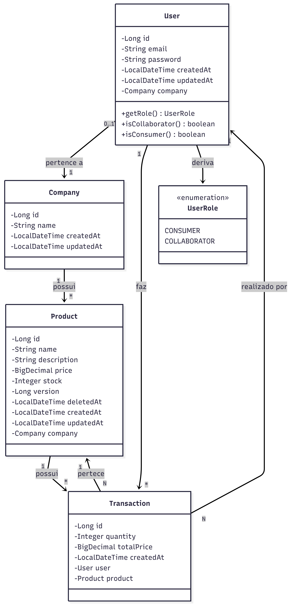

# CONTEXTO

Precisamos implementar um backend para o case da knex — uma **API RESTful stateless** onde o servidor não armazena sessão. O usuário acessa os endpoints com um token JWT que a aplicação valida a cada requisição.

A aplicação é uma **plataforma de vendas corporativas** com dois tipos de usuários:

> **Colaboradores:** Usuários vinculados a uma empresa que podem criar, editar e deletar produtos da própria empresa. Também podem comprar produtos de outras empresas.

> **Consumidores:** Usuários sem vinculação com empresa. Têm acesso de leitura ao catálogo completo e podem realizar compras de qualquer produto.

# STACK


# Arquitetura do Projeto

Utilizamos uma **arquitetura em camadas** simples e eficiente, sem complexidade desnecessária:

> **Camada de Controllers:** `controllers/` — Responsável por receber requisições HTTP, validar entrada e encaminhar para a camada de serviço.

> **Camada de Serviço:** `services/` — Contém toda a lógica de negócio, validações e orquestração entre repositórios.

> **Camada de Persistência:** `repositories/` e `entities/` — Acesso direto ao banco de dados via JPA, definição das entidades do domínio.

> **Mapeamento de Dados:** `dtos/` — Objetos de transferência de dados organizados por contexto. `mappers/` — Conversão bidirecional entre DTO ↔ Entity.

> **Validação e Constantes:** `validators/` — Validações de regras de negócio. `constants/` — Mensagens, valores fixos e enumerações.

> **Infraestrutura:** `config/` — Configuração da aplicação. `security/` — Autenticação JWT e autorização. `exceptions/` — Tratamento centralizado de exceções.

# Diagrama UML de Classes do Projeto



# Regras de Negócio

> **Autorização por Empresa:** Colaborador só pode `criar`, `editar` e `deletar` produtos de sua própria empresa. Tentativa de `editar/deletar` produto de outra empresa retorna `403 Forbidden`.

> **Tipos de Usuários:** Usuário com `company != null` é colaborador (gerencia produtos). Usuário com `company == null` é consumidor (apenas compra).

> **Listagem de Produtos:** Qualquer usuário, autenticado ou não, pode fazer `GET /produtos` para visualizar o catálogo. Um consumidor precisa ver os produtos antes de fazer uma compra.

> **Transações/Compras:** Qualquer usuário autenticado pode fazer compras. A transação reduz o `stock` do produto em 1 unidade. Não é permitido comprar mais do que existe em `stock`.

> **Criação de Empresa:** Apenas usuários autenticados podem `criar` uma empresa (se ainda não tiverem). Uma empresa é criada pelo colaborador que a representa.

> **Validações de Dados:** Produtos não podem ter `stock` negativo. Preços não podem ser negativos ou zero.

## Reflexões sobre as Regras de Negócio

### Empresa e Colaborador

- Um usuário pode criar/gerenciar múltiplas empresas ou é vinculado a apenas uma?
- Uma empresa pode ter múltiplos colaboradores (ex: Arthur e outro gerenciador)?

> **R1:** Um usuário pode criar apenas uma empresa dentro da plataforma por conta.
> **R2:** Uma empresa para esse MVP deve ter apenas um colaborador, que é o usuário que criou a conta.

---

### Criação de Produtos

- Apenas colaboradores podem criar produtos?
- Ao criar um produto, ele automaticamente pertence à empresa do colaborador?

> **R1:** Apenas colaboradores podem criar produtos.
> **R2:** Sim. Quando o usuário cria uma empresa ele se torna um colaborador da plataforma, então ele pode criar produtos para a empresa dele.

---

### Consumidor x Colaborador

- Um consumidor pode se tornar colaborador depois (criar empresa)?
- Ou precisa ser criado já como colaborador desde o início?

> **R1:** Sim. Um consumidor pode se tornar colaborador ao abrir uma empresa — similar ao modelo de vendedor do Shopee, onde o usuário se cadastra normalmente e tem a possibilidade de se tornar um vendedor.
> **R2:** Não precisa ser criado como colaborador desde o início.

---

### Transações/Compras

- Colaborador pode comprar produtos de sua própria empresa?
- Se comprar, o stock é reduzido normalmente?

> **R1 e R2:** Sim para ambas.

---

### Deleção de Produtos

- Pode deletar um produto que já foi comprado?
- Há alguma validação (ex: produtos em transação não podem ser deletados)?
- E se houver 2 produtos em stock e 5 usuários comprando ao mesmo tempo?

> O cenário de compras simultâneas com stock baixo é um ponto crítico. A questão central é: como garantir que dois usuários não comprem o mesmo item quando só existe uma unidade em stock?

#### Abordagem adotada: Optimistic Locking

A solução escolhida para esse MVP é o **Optimistic Locking**, suportado nativamente pelo JPA via anotação `@Version` na entidade de produto.

O funcionamento é simples: cada registro no banco possui um campo `version`. Quando dois usuários leem o mesmo produto simultaneamente e tentam atualizá-lo, apenas o primeiro commit é aceito. O segundo encontra uma versão desatualizada e recebe uma `OptimisticLockException`, que tratamos retornando `409 Conflict` para o cliente.

```java
@Entity
public class Product {
    // ...
    @Version
    private Long version;
}
```

**Por que Optimistic Locking aqui?**
- Não há bloqueio de linha no banco — leituras são livres e performáticas
- A contenção real (dois usuários no mesmo produto ao mesmo tempo) tende a ser baixa num MVP
- O JPA já resolve tudo nativamente, sem infraestrutura adicional
- Simples de implementar, fácil de entender e de testar

---

#### 📨 Alternativa descartada: Sistema de Mensageria

Uma alternativa mais robusta seria processar as compras de forma assíncrona com um sistema de mensageria como **RabbitMQ** ou **Kafka**. O fluxo seria: o usuário envia a intenção de compra → a mensagem entra numa fila → um consumer processa as compras em ordem, uma a uma, eliminando a condição de corrida por design.

**Por que não aqui?**
- Exige infraestrutura adicional (broker, consumer, filas, monitoramento)
- Aumenta a complexidade operacional e de testes significativamente
- A compra deixa de ser síncrona — o usuário não recebe confirmação imediata, o que exigiria um mecanismo de notificação separado (webhook, polling, WebSocket)
- Para o volume e o escopo desse MVP, é **overkill**

> **Conclusão:** O Optimistic Locking resolve o problema com a menor fricção possível para o contexto atual. A mensageria seria o caminho natural caso a plataforma evoluísse para um cenário de alta concorrência real.
